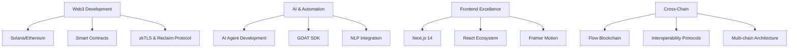

# Divyanshu Urmaliya

**Web3 Growth Architect** • **Community Builder** • **AI Agent Developer**

*Scaling Web3 ecosystems from 0 to millions • Building the future of decentralized communities*

---

## Current Focus

🏗️ **Head of Operations** at [Aarambh Labs](https://github.com/urmaliyadivyanshu31) — Scaling Titan Technologies (30M+ TVL)  
🌐 **Co-Founder** of [Bhopal DAO](https://github.com/urmaliyadivyanshu31) — Central India's premier Web3 hub (2K+ members)  
🤖 **Building** AI agents for Web3 automation and cross-chain interoperability  

---

## Featured Projects

<table>
<tr>
<td width="50%">

### [BackersStage](https://github.com/urmaliyadivyanshu31)
**Premier Web3 Startup Ecosystem**
```typescript
Tech: Next.js 14, Framer Motion, Tailwind
Status: ✅ Live Production
```
Connecting Web3 startups with investors. Coordinated TOKEN2049 Dubai & ETHCC'25.

</td>
<td width="50%">

### [DASHH](https://github.com/urmaliyadivyanshu31)
**Decentralized Ad Platform**
```solidity
Tech: Solana, Reclaim Protocol, zkTLS, React
Status: ✅ Live Production
```
Fighting ad fraud with zkTLS proofs. Genuine engagement, transparent rewards.

</td>
</tr>
<tr>
<td width="50%">

### [Buck Terminal](https://github.com/urmaliyadivyanshu31)
**Onchain AI Agent**
```javascript
Tech: GOAT SDK, NLP, Smart Contracts, SEI
Status: 🚧 In Development
```
Natural language ERC20 token creation with real-time market analytics.

</td>
<td width="50%">

### [Flow Beats](https://github.com/urmaliyadivyanshu31)
**Multi-Gaming P2E Platform**
```cadence
Tech: Flow Blockchain, Niftory API, React
Status: ⭐ Community Favorite
```
Ultimate gaming platform with integrated P2E and NFT rewards system.

</td>
</tr>
</table>

---

## Impact & Achievements

- 🚀 **30M+ TVL** — Scaled Web3 asset management operations
- 👥 **2K+ Community** — Grew Bhopal DAO from 0 to Central India's Web3 hub
- ⚡ **60%+ Productivity** — Boosted team efficiency with AI-driven automation
- 🎯 **50+ Initiatives** — Led blockchain projects, hackathons, and partnerships
- 🌍 **8+ Major Events** — Organized international conferences with $50K+ prizes

---

## Tech Arsenal



**Languages & Frameworks:**  
`Solidity` `TypeScript` `JavaScript` `Cadence` `Python` `Next.js` `React` `Node.js` `FastAPI`

**Web3 & Blockchain:**  
`Ethereum` `Solana` `Flow` `Smart Contracts` `zkTLS` `Reclaim Protocol` `GOAT SDK` `Cross-chain`

**Tools & Platforms:**  
`Vercel` `Firebase` `Niftory API` `Framer Motion` `TailwindCSS` `Prisma` `PostgreSQL`

---

## Recognition & Partnerships

<div align="center">

| **Ecosystem Partners** | **Event Partnerships** | **Research Collective** |
|:---:|:---:|:---:|
| Ethereum Foundation | TOKEN2049 Dubai | Axelar Network |
| Push Protocol | ETHCC'25 | 50+ Researchers |
| AirDAO | 8+ International Events | Cross-chain DeFi |
| Berachain | 500+ Developers | Developer Tooling |

</div>

---

## Let's Build Together

<div align="center">

[](https://0xdiv.me)
[](mailto:urmaliyadiv04@gmail.com)
[](https://twitter.com/divyanshueth)
[](https://linkedin.com/in/urmaliyadivyanshu)

</div>

---

<div align="center">

### *"Building the infrastructure for Web3's next billion users"*

**Open to collaborations • Always learning • Forever building**


</div>

<!--
This README is a living document. 
Continuously updated as I ship new projects and scale Web3 ecosystems.
Last updated: January 2025
-->
